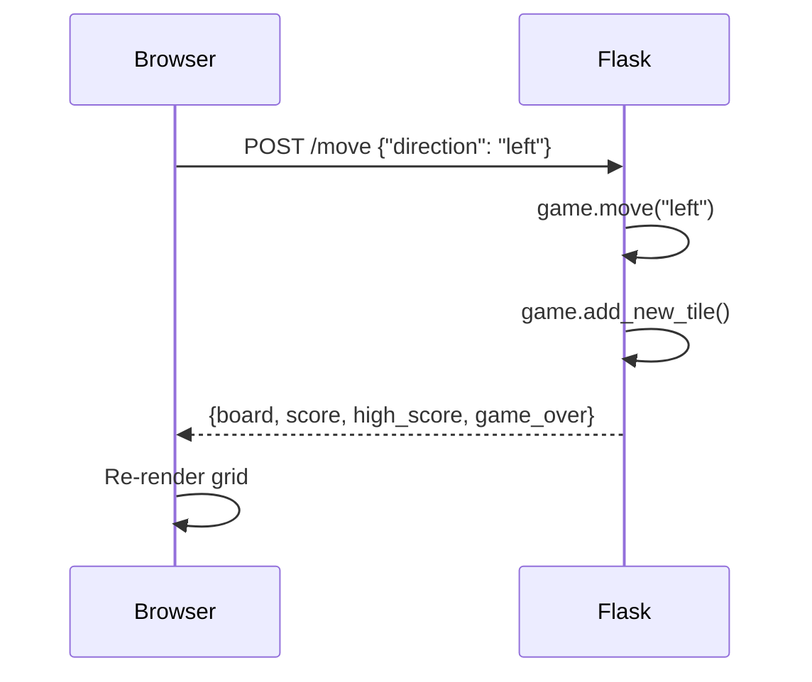

The web version of 2048 is a [Flask](https://flask.palletsprojects.com/) application that serves an HTML/CSS/JavaScript frontend and exposes a small JSON API for game logic. The browser handles keyboard input and rendering; the server handles all game state and move calculations.

## Prerequisites

- **Python 3.x** — [python.org/downloads](https://www.python.org/downloads/)
- **Flask** — the only required dependency

Install Flask with pip:

```bash
pip install flask
```

<Note>
The web version uses plain Python lists for the grid (`[[0]*4]*4`) rather than NumPy arrays. NumPy is **not** required for this version.
</Note>

## Starting the server

<Steps>
  <Step title="Install Flask">
    ```bash
    pip install flask
    ```
  </Step>
  <Step title="Run the application">
    ```bash
    python app.py
    ```
  </Step>
  <Step title="Open in your browser">
    Navigate to [http://localhost:5000](http://localhost:5000). The game loads immediately.
  </Step>
</Steps>

<Note>
Flask's built-in development server starts on `http://127.0.0.1:5000` with `debug=True`. Do not use this server in a production environment.
</Note>

## Web interface

The frontend is a single HTML page (`templates/index.html`) served by Flask's `render_template`. It includes:

- A 4×4 CSS grid rendered from the board state returned by the server
- A **Score** counter and **Best** (high score) counter
- A **New Game** button
- JavaScript that listens for `keydown` events and sends moves to the server via `fetch`

## How moves are processed

Every keypress in the browser triggers a `POST /move` request to the Flask server. The server updates the game state and returns the new board. The browser then re-renders the grid.



## API reference

### POST /move

Processes a single move in the chosen direction.

**Request body:**

```json
{
  "direction": "left"
}
```

Accepted values for `direction`: `"left"`, `"right"`, `"up"`, `"down"`.

**Response:**

```json
{
  "board": [[0, 2, 4, 0], [0, 0, 8, 0], [0, 0, 0, 2], [0, 0, 0, 0]],
  "score": 14,
  "high_score": 42,
  "game_over": false
}
```

| Field | Type | Description |
|---|---|---|
| `board` | `number[][]` | 4×4 nested array of current tile values. `0` means empty. |
| `score` | `number` | Current game score. |
| `high_score` | `number` | Highest score reached in the current session. |
| `game_over` | `boolean` | `true` when no moves remain. |

### POST /reset

Starts a new game. Resets the board and score to their initial state.

**Request body:** none required.

**Response:** same shape as `/move`.

```json
{
  "board": [[2, 0, 0, 0], [0, 0, 0, 0], [0, 0, 0, 0], [0, 0, 2, 0]],
  "score": 0,
  "high_score": 42,
  "game_over": false
}
```

### GET /

Serves the HTML frontend. No parameters required.

## Game state and sessions

The Flask app imports `session` from Flask and uses `app.secret_key = 'mysecretkey'` to enable server-side sessions. The `Game2048` instance is associated with the current user session, so each browser tab or client maintains independent game state.

<Warning>
The default secret key `'mysecretkey'` in the source is a development placeholder. If you expose this server to other users, set a strong random secret key via an environment variable before starting the server:

```bash
export FLASK_SECRET_KEY=$(python -c "import secrets; print(secrets.token_hex())")
```
</Warning>

## Keyboard controls

The JavaScript frontend maps the four arrow keys to directions sent to `POST /move`:

| Key | Direction sent |
|---|---|
| `←` Arrow Left | `"left"` |
| `→` Arrow Right | `"right"` |
| `↑` Arrow Up | `"up"` |
| `↓` Arrow Down | `"down"` |

<Note>
WASD keys are not bound in the web version by default. Only arrow keys are handled by the JavaScript event listener.
</Note>

## Score display

- **Score** — increments with each merge. Sent from the server in every `/move` response.
- **Best** — the `high_score` field in responses. Updated server-side whenever `score` exceeds the previous `high_score`.

## New Game button

Clicking **New Game** sends `POST /reset`. The server calls `game.new_game()`, which:

1. Re-initializes the 4×4 grid to all zeros.
2. Resets `self.score` to `0`.
3. Spawns two random tiles.

The browser receives the fresh board state in the response and re-renders.

## Development server note

The server is started with `app.run(debug=True)`, which enables:

- **Auto-reload** — the server restarts when you save changes to `app.py`.
- **Interactive debugger** — unhandled exceptions open an in-browser debugger.
- **Verbose logging** — requests are printed to the terminal.

```bash
 * Running on http://127.0.0.1:5000
 * Debug mode: on
 * Restarting with stat
```

<Warning>
`debug=True` exposes an interactive Python debugger in the browser. Never run with debug mode enabled on a publicly accessible server.
</Warning>
